# Midterm_Running_Project
Running data - for midterm

## Description
Ultra Marathon running data cleaned for the top 100 distance races in the United States. Data depicts specific athletes, years, events, distance, state of event, and race times as an example of the columns contained in the information.  The data shows the top 100 events data from 1963 to 2021.

## Project Proposal
- Does Elevation average of states or elevation gain have a factor in race times?
- Do race times get better over the years from 1963 to 2022?
- What are the states with the average race paces that are higher?
- Is age associated to running faster with elevation gain?
- What is the fastest running time per minimum and maximum elevation gain by state?
- Find the correlation between age and race location(state) along with the time it takes to run the races (hours).  Is there a correlation?

## Table of Contents
- [Installation](#installation)
- [Usage](#Usage)
- [Contributing](#contributing)
- [License](#license)
- [Contact](#contact)

## Installation
### Prerequisites
- List of libraries required:
    - pandas as pd
    - numpy as np
    - matplotlib.pyplot as plt
    - seaborn as sns
    - plotly.express as px
    - import re
    - import folium

### Steps
1. The data is very large and can be downloaded from:
https://www.kaggle.com/datasets/aiaiaidavid/the-big-dataset-of-ultra-marathon-running
The data is pulled from multiple sources including mains websites from:
    - https://ultrasignup.com
    - https://ultrarunning.com
2. Gather further information in regards to the data referenced you want to learn about.  I chose the top 100 races by distance (Not by time i.e. a 24 hour run) and only in the United States.  I then added elevation gain as well as the highest elevation point of each race.  I also included the state each event was located in.  For this I just used open source search engines.  I have added my newfound data to the data files.
3. Merge the data to clean.

## Usage
### Descirbe how I cleaned and transformed the data
- To fully understand how the data was cleaned, open the cleaning_data.ipynb in the notebook folder.
- The data from kaggle had over 7.4 million rows of data and only events within the United States were returned.
- New data was added from the top 100 events by participants within the United States. 100 events were chosen as a pool from over 6,000 events from the United States.  The new data contains elevation gain, highest elevation of each race, state of race, miles of each race, and average elevation of each state.
- After the data was merged, all events not within the top 100 chosen were removed.  All 100 races are by distance and not a timed race.
- The new data set removed nearly 7 million rows and left with roughly 420,000 rows for the top 100 events by distance.
- The data was further manipulated from issues with the dates. Regex was utilized to fix multiple dates formatted in separate ways so a Date Time Group (DTG) could be utilized.
### What visiualizations do we need to understand your topic?
- Scatter Plots
- Bar Charts
- Line Plots
- Box Plots
- Choropleth
- Folium Map
- Correlation Matrix

## What visualizations display your results?
- Race Locations on Map
#### 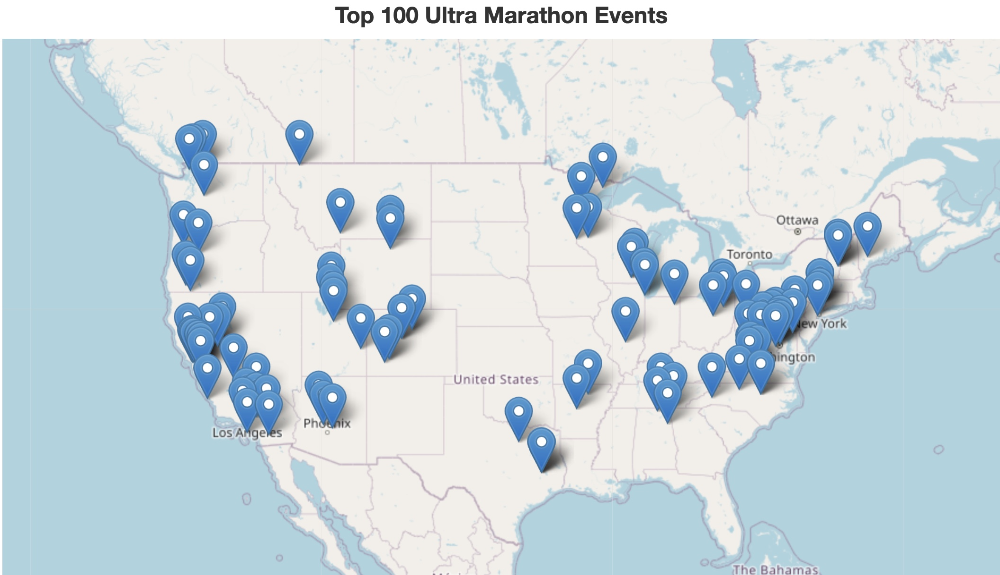
- Race Locations on Heat Map
#### 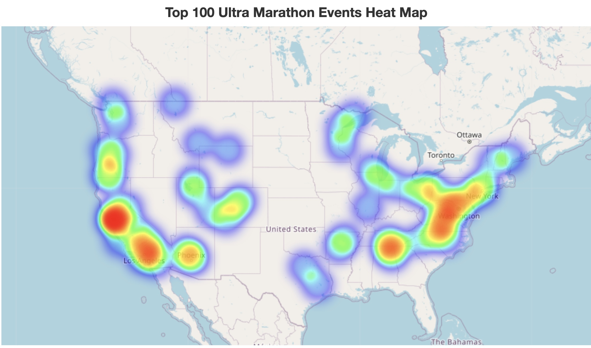
### Does Elevation average of states or elevation gain have a factor in race times?
- Average Elevation Gain and Race Pace by State
#### 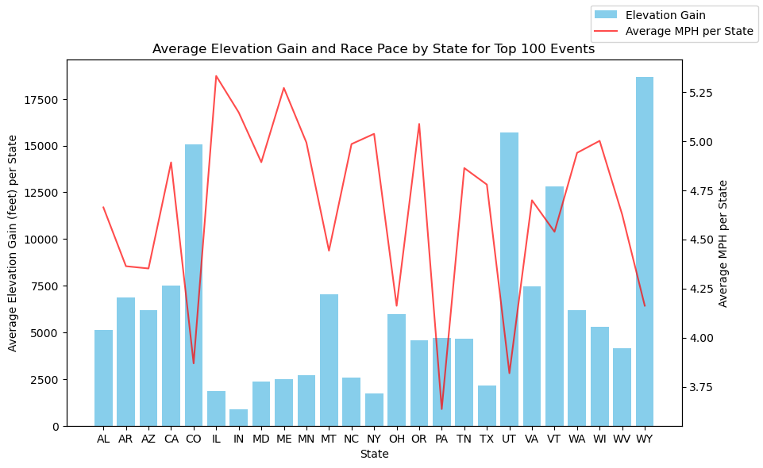
- Average State Elevation and Race Pace by State
#### 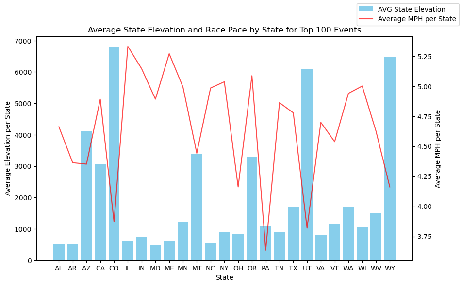
- Average Elevation Gain and Max Pace by State
#### 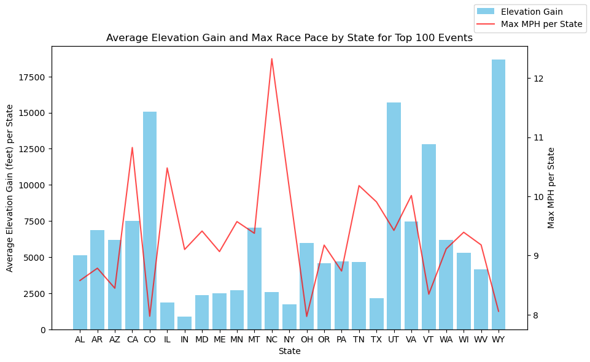
- Min and Max Pace per Year by Count of Athletes
### Do race times get better over the years from 1963 to 2022?
#### 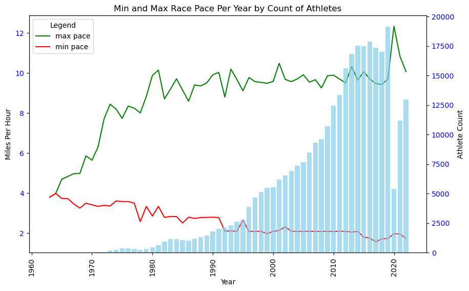
### What are the states with the average race paces that are higher?
- Map of Average Race Pace per Events
#### 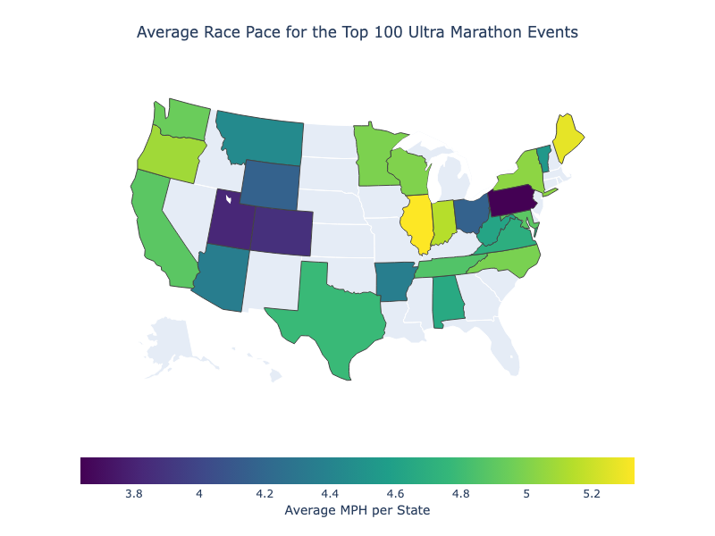
### Is age associated to running faster with elevation gain?
- Scatter Plot of Pace vs Age by Elevation Gain
#### 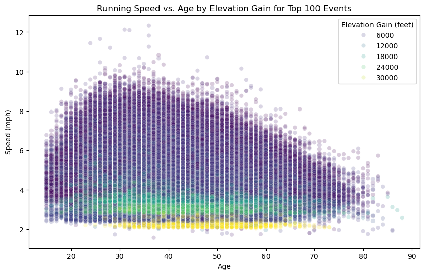
### What is the fastest running time per minimum and maximum elevation gain by state?
- Min and Max Elevation Gain by State
#### 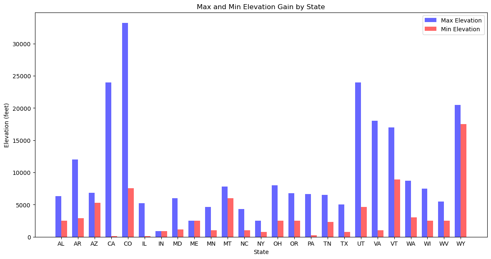
- Fastest Running Times by State for Min and Max Elevation Gain
#### 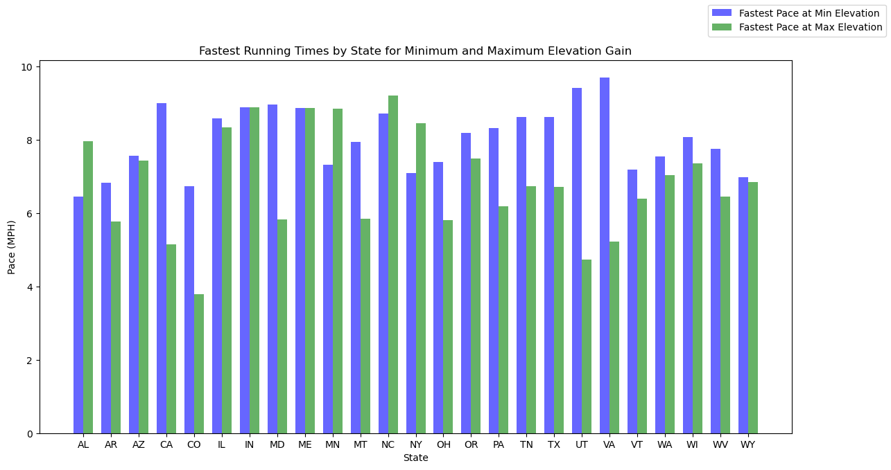
### Find the correlation between age and race location(state) along with the time it takes to run the races (hours).  Is there a correlation?
- Age Vs Hours Ran
#### 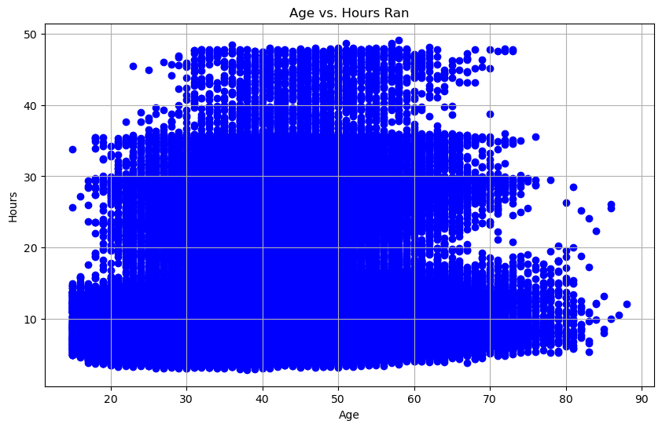
- Hours Ran Distribution by State
#### 
- Average Hours Ran per State
#### 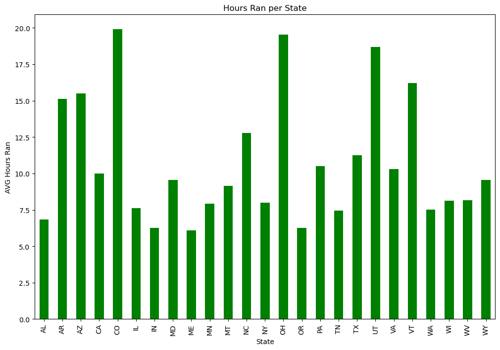
- Correlation Matrix of Pace, Age, and State
#### 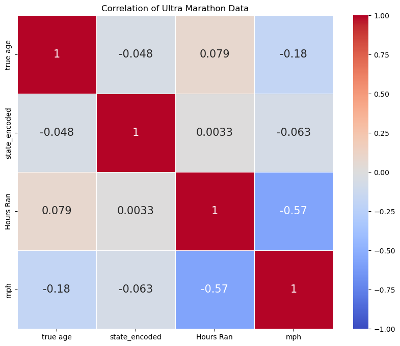
- Correlation Matrix of Main Columns
#### 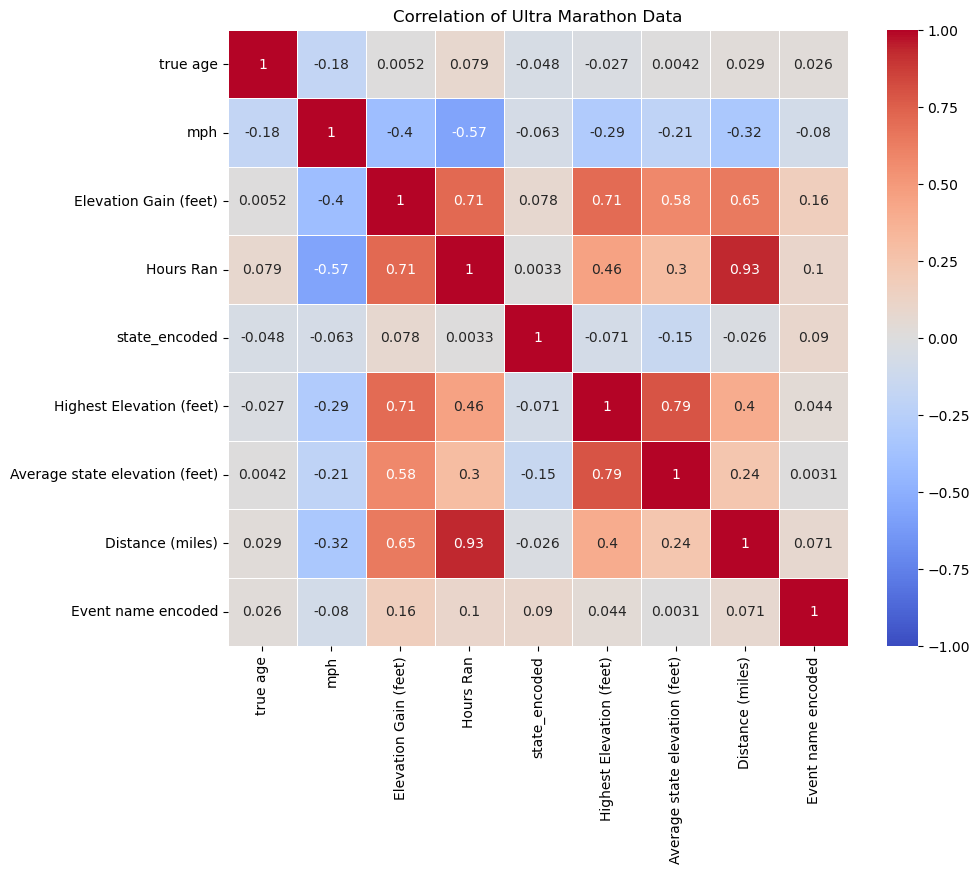
### (Present key insights)
### (Tell us what you recommend)
### (Tell us what future areas you might want/need to study)

## Contributing
To contribute to this project, continue to add where to find pertinent data about each race to enhance further exploration of data analysis of Ultra Marathon Running.

## License
This project is licensed under the LGPL-2.1 License.

## Contact

- Author - Justin Welch
- GitHub - https://github.com/jdwelch88